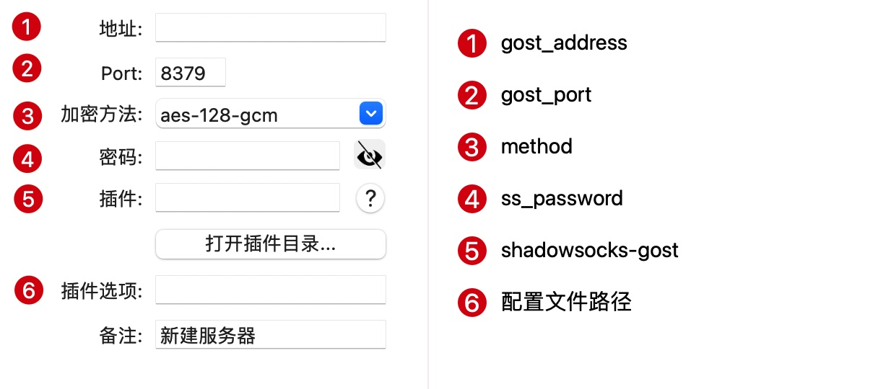

# 配置文件

# 必填

需要指定为正确的参数

* gost_path: gost 可执行文件的路径，shadowsocks 插件在子进程中，无法通过 PATH 获取到 gost 可执行文件位置
* gost_address: gost 服务器地址
* gost_port: gost 服务器端口
* gost_auth: gost 服务器认证串，格式为 用户名:密码

## 非必填

默认配置即可使用

* debug: 非必须，开启调试模式，插件会将配置文件和 gost 程序的输出打印到 shadowsocks 的标准输出中，默认 false
* ss_password: 本地 shadowsocks 密码，默认 123456
* method: shadowsocks 加密方式，默认 chacha20-ietf-poly1305

## 样例

```javascript
{
    "debug": false,
    "ss_password": "123456",
    "method": "chacha20-ietf-poly1305",
    "gost_path": "",
    "gost_Address": "",
    "gost_port": 443,
    "gost_auth": "aG93IGRhcmUgeW91"
}
```

